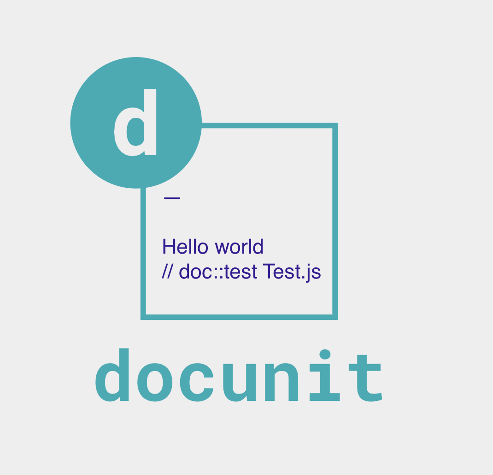

# docunit

CLI for verifying ascidoctor documentation by executing unit tests that can verfy their correctness.



## Getting started

1. Apply comment into your ascidocs files

```
// doc::test Test.js
```

2. Build your test file in  `doctest/Test.js`

```js
const http = require('http');
const test = require('ava');
const got = require('got');
const listen = require('test-listen');
const app = require('../app');

test.before(async t => {
	t.context.server = http.createServer(app);
	t.context.baseURL = await listen(t.context.server);
});

test.after.always(t => {
	t.context.server.close();
});

test.serial('get /user', async t => {
	const res = await got('/user', { baseURL: t.context.baseURL, json: true });
	t.is(res.body.email, 'test@user.com');
});
```

## Features

- Repeatable testing of your documentation
- Reporting documentation failures

## Local Development

Below is a list of commands you will probably find useful.

### `npm start` or `yarn start`

Runs the project in development/watch mode. Your project will be rebuilt upon changes. TSDX has a special logger for you convenience. Error messages are pretty printed and formatted for compatibility VS Code's Problems tab.


Your library will be rebuilt if you make edits.

### `npm run build` or `yarn build`

Bundles the package to the `dist` folder.
The package is optimized and bundled with Rollup into multiple formats (CommonJS, UMD, and ES Module).


### `npm test` or `yarn test`

Runs the test watcher (Jest) in an interactive mode.
By default, runs tests related to files changed since the last commit.
